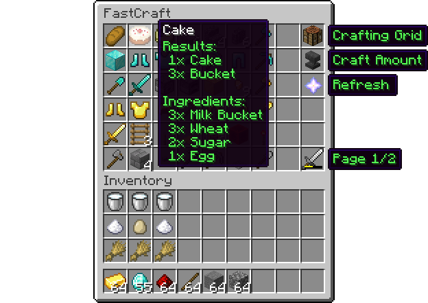

Looking for FastCraft v2? Click [here](https://github.com/BenWoodworth/FastCraft/tree/v2/master)!

# FastCraft
FastCraft is a Minecraft server plugin that changes the
way players craft their items.
With FastCraft, players can craft items faster than ever!
Instead of the usual 3x3 crafting grid, players will be shown
the FastCraft user interface, which shows all of the items
that can be crafted from the items within their inventory.
To craft an item, all they have to do is click on an item in
the GUI, and the item will be crafted automatically!

    

## Server Requirements
- Java 8+
- Bukkit 1.7.5 - 1.15+

## Configuration
A configuration has not yet been implemented

## Commands
Commands have not yet been implemented

## Permissions
| Permission    | Description           |
|---------------|-----------------------|
| fastcraft.use | Use the FastCraft GUI |

## Building FastCraft
A guide on how to build FastCraft can be found [here](https://github.com/BenWoodworth/FastCraft/wiki/Building-FastCraft).
