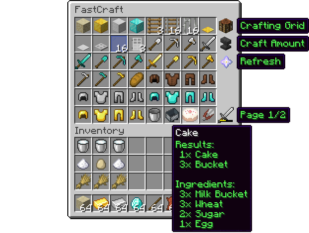

# FastCraft
FastCraft is a Minecraft server plugin that changes the
way players craft their items, allowing items to be crafted
in a single click. Instead of the usual 3x3 crafting grid,
players will be shown all the items
that can be crafted from the items in their inventory, and
clicking one of the items will automatically remove the
required ingredients from the players inventory, and give
the newly crafted item.

    

All documentation can be found on the [FastCraft wiki](https://github.com/BenWoodworth/FastCraft/wiki).
